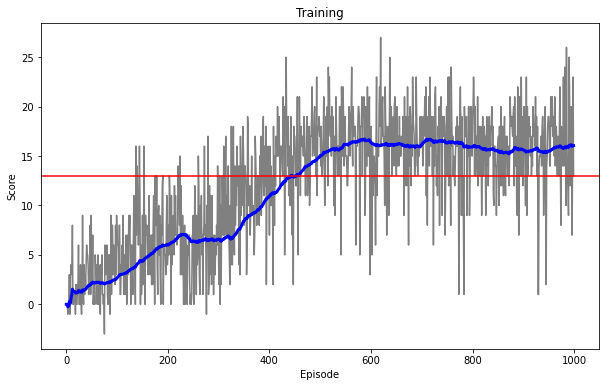

# Report

## Learning Algorithm

#### Q-learning pseudocode
The core of the learning agent is based on Deep Q-Networks [[1]](#dqn_paper). At a high-level, the agent follows a Q-learning algorithm:

```
Initialize Q-network
Initialize replay buffer of BUFFER_SIZE
For each episode:
    Reset the environment
    While the episode has not yet ended:
        Agent selects EPSILON-greedy action using the Q-network, given the current state
        Execute the selected action in the environment
        Observe the reward and next_state returned by the environment
        Store (state, action, reward, next_state) tuple in the replay buffer

        On every UPDATE_EVERY-th:
            Sample BATCH_SIZE samples from the replay buffer
            Calculate the loss function over the sampled batch
            Learn updated Q-network, performing gradient descent on the loss
```

For in-depth analysis and explanation of the Deep Q-Network and its design, please refer to [[1]](#dqn_paper). The main important points to note:

- The **Q-network** acts as a function approximator for the Q-value of every state-action pair.
- Since the environment provides us with the state, we learn directly on the state variables (instead of the 64x64 image input as in [[1]](#dqn_paper)). This simplifies our learning process, allowing us to use a Q-network that operates directly on the 37-dimension input state without needing convolutional layers.
- During the learning step, the Q-network applies the Bellman equation to minimize a **loss function** describing the mean-squared error between the network's estimated Q-value and the target Q-value which is based on the sampled reward.
- To remove correlations in the observation sequence, the algorithm uses **experience replay**. We accumulate a buffer of experience samples while exploring the environment, then perform learning in a offline fashion by sampling from the buffer in a uniform random way to perform batched learning.
- The algorithm maintains a **separate target Q-network** which is identical to the main Q-network, but only updated periodically. This helps to keep the target still during training, and improves the stability of the learning.
- Our final solution uses a fixed `EPSILON = 0`, which means that the agent always acts greedily. Empirically, this was found to perform well (see [Results](#results) below).


#### Hyperparameters
```python
BUFFER_SIZE = 1e5       # replay buffer size
BATCH_SIZE = 64         # minibatch size
GAMMA = 0.99            # discount factor
TAU = 1e-3              # for soft update of target parameters
LR = 5e-4               # learning rate 
UPDATE_EVERY = 4        # how often to update the network
EPSILON = 0             # fixed epsilon
```

#### Network architecture

The Q-network has a simple architecture consisting of 2 fully-connected hidden layers between the input and output layers:
```
INPUT LAYER:        37 input state dimensions
HIDDEN LAYER 1:     Fully-connected layer of size 64
HIDDEN LAYER 2:     Fully-connected layer of size 64
OUTPUT LAYER:       4 output action dimensions
```
Between each layer, we apply a Rectified Linear Unit (ReLU).

## Results

The agent successfully solves the environment after 442 episodes, where the moving average (over a 100-episode window) crosses the target of +13.



_The plot above shows the training of the agent over 1000 episodes. The grey plot is the score of the agent at each episode; the blue plot is the score of the agent over a moving average window of 100 episodes (at <100 episodes, the moving average is taken from episode 0 to the current episode); the red line indicates the threshold +13 where the environment is considered solved._

We note that the agent's score plateaus at approximately +16, from episode 600 onwards.

## Future Work
Many possible improvements could be made to the algorithm.

#### Hyperparameter tuning
The current solution was chosen by comparing the results from a small sample of hand-chosen hyperparameters. It is likely that by running a large scale hyperparameter search (including model architecture search), it will be possible to improve the results.

#### Algorithm extensions

This solution implements the original DQN algorithm based on [[1]](#dqn_paper). Since its introduction, many variants of the original DQN algorithm have been proposed to push the state-of-the-art further. In particular, implementing variants such as Double Q-learning [[2]](#double_q_learning), Prioritized Experience Replay [[3]](#prioritized_replay), and Dueling Network Architectures [[4]](#dueling_networks) could potentially improve the training speed and overall result of our solution.

## References
- <a name="dqn_paper">[1]</a> Mnih, Volodymyr, et al. "Human-level control through deep reinforcement learning." nature 518.7540 (2015): 529-533.
- <a name="double_q_learning">[2]</a> Van Hasselt, Hado, Arthur Guez, and David Silver. "Deep reinforcement learning with double q-learning." arXiv preprint arXiv:1509.06461 (2015).
- <a name="prioritized_replay">[3]</a> Schaul, Tom, et al. "Prioritized experience replay." arXiv preprint arXiv:1511.05952 (2015).
- <a name="dueling_networks">[4]</a> Wang, Ziyu, et al. "Dueling network architectures for deep reinforcement learning." International conference on machine learning. 2016.
